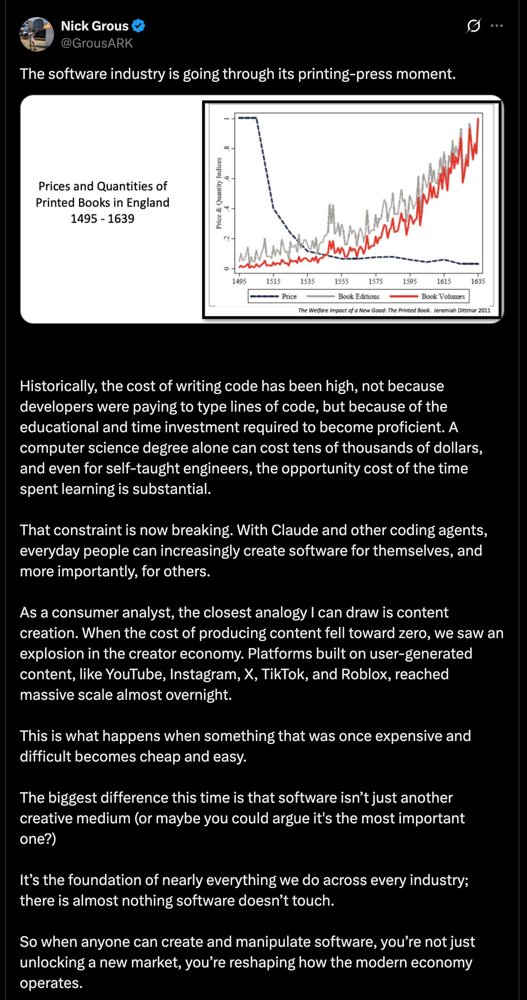
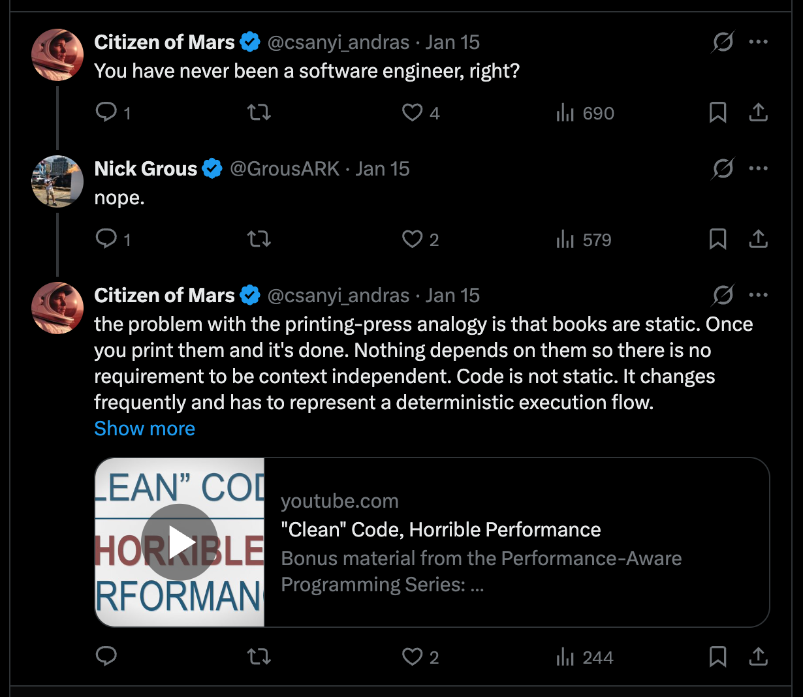

---
title: "Printing press analogy for AI"
author: "András Csányi"
date: "2026-01-17"
date-modified: "2026-01-17"
image: "../x.thumbnail.png"
categories:
  - AI
  - History
  - Dynamical Systems
  - X posts
---

A few days back I read the post below and it just didn't feel right. 
I commented it a few hours later, but it still lives rent free in my head.
My itch with it is that it feels correct, but still sloppy and I want to track
down why it feels that way.
This is a repeating phenomena in my life.
There are things feel correct, but I have the feeling of they are just wrong and
after a while turns out my hunch was right.
This happen mainly with corporate level management decisions.
This should not be a surprise since I have been working for big corporations for
a long time and had many different positions and with the insights they have.
Another aspecct is that the thinking patter required for working with dynamical
systems has a significant impact on the way I analyse situations. 
One might say that I have "a dynamical system hammer" so that I see everything as
"a linearisation from chaos for control" nail.
This is not far from the truth.
I spend significant amount of my time to learn this type of analysis better and
find its shortcomings.
I am also willing to drop any result if turns out it is wrong.
You'll see that I don't apply the mathematical rigour when I talk about how
dynamical systems properties can be used to model a historical situation.
A decent mathematical description of Psychohistory is scheduled for later this week.

The orignal post makes an analogy between what impact the printing press caused
and what AI tools will do in the future. The reason it doesn't feel correct is
the implicit suggestion that back in the 1500's the only thing was missing was the
printing press.
Its appearance caused explosive changes in the world.
I don't think the explosive nature of changes is true.
At this point we step into the meaning of words problem space without any
agreement what is the meaning of words.
Welcome to the Context Dependent World.

It is true the printing press enabled spread of information and ideas.
But the education of the populuce wasn't really at the level to be hungry for
new ideas.
Just take a look at the literacy rate in the world around that time.
There was a thin literate layer in the population and majority of them was part
of the clerical class.
The clerical class didn't have any stake in supporting the spread of ideas.
Rather the opposite as we see in Galileo's and Giordano Bruno's case. 
Or if you are hungry for a romantic story then read the Name of The Rose by
Umberto Eco.
It is also true it helped forming the national languages in oppositon to latin.
But, the real enabler here were rather the translated Bibles and the clerical
ceremonies conducted by national languages.

My argument is that for an explosion you need fertile soil that misses only that
one or just very few components.
At that time one leg of Europe was still in the dark middle ages and calling it fertile
soil would be a significant exaggeration.
The appearance of printing press was an enabler.
It provided a more effective way to spread ideas and information.
The rebellious thoughts found their way before the printing press was invented.

As for dynamical systems thinking. 
The situation around 1500 looks like a stable point or a source with some
strength kept under the lid.
Maybe the lid by its own weight was enough.
Except the Spanish Inquisition.
Nobody expected that.
As you feed back the system result to itself you don't see exponential growth.
What you see is a graph that more than linear but less than anything above
linear and over generations it leaves meaningfully the linear regime, but I don't know
if it ever reached the exponential.
Not to mention that the system produces further sources and sinks but still no
signs of explosive changes. 
In my thoughts the chaotic soup that can produce surprising combinations and
results is around 1750-1800 which is the Industrial Revolution. 
My gut feeling here is based on James Burke's books.
I don't see an explosive changes here that could be a good analogy for what AI
can do for us, if it can.

The second problem with the analogy is that it assumes forces who wants the
current status quo unchanged.
I am a software engineer and if there is a better status quo to create software
you have me onboard.

The argument Nick Grous makes in his post is weak because lacks of understanding
software engineering.
What printing press brought us is the ability to multiply, but it didn't bring
the ability to create new ideas. 
The latter came later as the existing and new
ideas, produced by that thin layer of literate and not clerical people, started
working on the illiterate soil and transformed it into a fertile one.
By putting a very shallow analogy here, we introduced some automation in the
process.
But saying that the automation is the essential part of a cause - effect in this
case is misleading. 
The information produced in higher volume made it possible to reduce illiteracy
and the higher levels of literacy enabled the new ideas.
If you look at the timeline the latter fits well as the significant changes
happened generations after the appearance of the printing press.
There is no doubt Gutenberg is one of the coolest guy in history.
I am a librarian by training and hats off to him.

Let's see what we have in software engineering and why the analogy is terrible.
As I eluded in my answer software engineering is a chaotic process.
If you need proof for this here is an aspect that makes it as problematic as
literature: YAGNI, DRY, KISS, Design Patterns, SOLID, etc.
All of these abbreviations are about how to make the code easier to read for
humans.
When I say code, it means a project that consists of 30+k lines of code and
represents a normal complexity in software engineering.
They are stylistic guidelines that help making the code more readable for
humans.
The machine doesn't give a flying f*bomb about how the code is structured.
It's stack machine grinds through it and it is done.
As a basic guideline, anything that includes humans related aspects like style
is chaotic because it is context dependent.
The language we speak is context dependent.
Just think of how the meaning of "sick" changes when it appears in different
situations.
Moreover, we create new meanings as we go.

Software engineering, basically every engineering, is about linearising a
certain chaos. 
Translating between a chaotic, context dependent language, and
deterministic, context independent language. 
Nothing more, nothing less.
Software engineers translate the set of ideas - defined loosely or precisely -
to a deterministic execution logic.
Aerospace engineers translate the the extremely violent exhaust of a rocket engine to
lift that puts mass into orbit.
Aerodynamics engineers translates the airflows to lift more and more
efficiently, so we can fly for less and less.
Engineers study for years to learn systems, concepts, abstractions, corner cases
and mathematics to be able to play a winning game against the chaos and harness
it.
The essence of our knowledge is stable control based on deep insights.
Control is the deterministic portion.
There are cases where control results in stochasticity, but in this case just
take a look at the probability of the expected outcome.
You'll find 90+ or rather 95+ numbers.
Meaning, the system stochasticity is squeezed into a very close to deterministic region.

AI models are stochastic.
Unpredictably stochastic.
So, we put an unpredictably stochastic tool into a workflow that expects
deterministic (or stochastic where the probability is squeezed to the almost
deterministic region) and we expect great results.
We will get random results.

My assumption is that only the human brain is able to translate between context
ependent and independent.
I speak 2-3 context independent languages (mechanical drawing, programming
languages and mathematics) and just observing how my thinking is jumping in
every direction while I write code is fascinating. 
The up and down directions are abstraction and specificity, respectively, while the left and
right are assiciations to another field with its own abstract - specific
hierarchies.

My imagination of how my brain works when I do any cognitive task is like the
following.
Whatever input I get it actives the direct knowledge and the closely related
ones.
When the input is more complex, coding for example, it actives all the topics
related to coding and it also spins up the compoiler in my brain and I speak
programming language.
Moreover, the visualisation department joins and shows the thinking in vibrant
visuals in many versions so the members of the Feeling department can "taste it",
"feel it" and "opinionate it".
At this point the Analytics department arrives and puts facts behind the
feelings and opinions and we reached an agreement, so my fingers can type.
And this happens with lightspeed.

This is the point where the real question shows itself:
what role AI can play in the translation engineering requires?
Where and what level of translation is needed?
How we are going to do the translation?
I am aware of that AI tools used to generate code based on BDD descriptions.
But I don't know how it scales.
In aerodynamics we say the airflow can be considered incompressible under 0.3
Mach becasue
there is only a few percentage difference between the "compressible airflow" and
"incompressible airflow" numbers.
Considering the airflow incompressible brings easier calculation, so it is a
good compromise.
In software engineering we sacrifice a decent amount of CPU performance to have
the code more readable for the next guy.

Knowing all of this let's conclude why the analogy is terrible.
In the printing press example we let a source go and turned out it is a weak
source one. 
In software engineering we want to use a stochasitc tool to linearise a chaotic
system and we expect deterministic results.
The "software engineering is done due to AI" is this.
In other words, we want to rip off the chaos and putting automation there.
It just won't work.
Chaos cannot be automated.
Chaos must be linearised first and after that we can talk about automation.

Probably, the analogy is correct when we understand that the printing press
was an enabler and not the missing piece for exponential or explosive growth.
Maybe, AI tools are enablers only and over time they contribute to other sources
appearing in vector field and pushing that graph farther and farther from the
linar regime.
 
The original post:
{target="_blank"}

My answer:
{target="_blank"}
