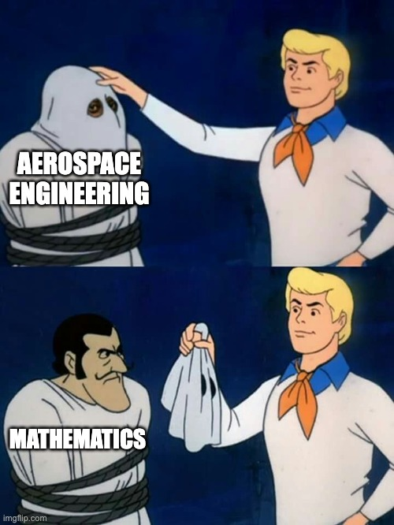

# How I study Mathematics

In the recent months and since the previous writings in the topic my view
formulated on "how to study" and it is time to collect my thoughts.

Let's start with the initial conditions that I am 46 years old and have some
experience in studying (2 Masters in Arts), but my study that time wasn't
effective. The strategies I had during the Arts Masters won't work in math
heavy fields.

My goal is a MSc in Aerospace Engineering and Applied Mathematics. The
mathematics just sneaked in recently due to the clear understanding of that
Aerospace Engineering is applied mathematics. Period. As a consequence, I have
to reshape my skills to serve my goals. Learning is a skill anyone can learn and
this is what I am doing now.

I have never learned how to learn. I remember 1-2 discussions with high school
teachers about this topic. Overall, I have never learned how to learn or how I
can learn during high school and while I was doing the Arts masters. High school
was easy, I could manage good grades with almost zero study effort. University
was as struggle, but I could manage it. Beside these zero or brute force methods
I have lot of stupid thoughts in my mind related to study and mathematics.
Overall, the goal is to manage the silly thoughts in my mind and find a way I
can study a lot and effectively.

I have another experience regarding studying complex topics and it shows a few
clues what I have to do. I learned software engineering by myself. It took
years, but the daily small effort brought its dividend. The other important
lesson from these years is that a complex topic is like an onion. The layers
need to be peeled off. You can't jump one layer. To go to a layer you need to
deal with the layers before it. It means there are level of understandings in
the knowledge. You won't get all by once.

Based on these things I worked out a light framework-ish something for myself.

## Language

The main idea behind this is the description of intuition. I heard this from a
very smart person and sounds like this: "intuition is signal from the mind to
say that it sees something here, but there is no language to express it". There
is the debate in linguistics whether the thought or the language exist first. I
don't know where this debate is right now. My experience is that as I learn a
language my thoughts follow the structures described by the language. For
example, in Hungarian there is no cohesive structure to express the same meaning
of that the English does with the "have been doing". I learned this structure of
thinking when I studied English. Hungarian can express this meaning, but it
takes a few sentences and there is grammatical structure for this.

When you study something it is a new language to express thoughts. So, it worth
to approach it as if you learn a new language. It means, it has structures and
connections and set of expressions to display these. If the new knowledge is a
language than the rules of language learning applies. When you study a language
you need to meet a word 5-10 times before you start using it and build it in
your set of tools. If this is true the first phase of learning is being exposed
to the language of the field. It is almost a volumetric problem. At least this
is the case for me.

## Getting familiar with the topic

I always page through the books a few times before I start reading it. This
makes the book, the topic to some extent familiar to me. The appendix shows some
structure and sometimes my eyes just stop here and there and start reading a few
words.

In the same time I build up a context in my mind to place the book. For example,
when I started reading about Dynamic Theory I asked Grok to explain in a simple
way what is Dynamic Theory, what role it plays in Aerospace Engineering and why
it is important and so on. When I recognise connections to other fields I ask
confirmation questions and ask Grok to explain the connection. This way I can
place the set of knowledge represented by the book in a context familiar for me
and by the questions I can build up some level of expectation in my mind what
questions (many times these questions are just feelings or intuitions or
assumptions, let's call them positive tension, an expectation or excitement)
going to be answered. Many times I make a sketch how these topics are connected.
You know, I am comfortable with the information retrieval thesaurus and its
simplified, free-style forms.

I believe this mental excitement is what prepares my brain to be in the "some
knowledge is incoming to this place" state. One can say that I made the material
interesting for myself. I don't like the "make it interesting" phrase for this
because it suggests the artificial excitement and silly questions. What I do is
connecting the future knowledge to something I already have and adding value to
this future connection.

## Light reading

This is very new thing for me, but it has its roots in the layered understanding
part. I read the book lightly. I understand what I understand and I don't put
more than comfortable effort into something if I don't get it. It is being
exposed to the language, how the field is structured, to see what is the
information processing of the field. It is like being in native environment and
just listen other people talk. Sometimes I make notes, sometimes I don't. When I
can make a connection to my existing knowledge I take that step, but nothing
mind wrecking effort.

## Focused reading of manageable chunks

At this point I already paged through the book a few times and I know what and
why I study. I already read the book at least once lightly.
The next step is creating chunks for focused reading.
This is the part of extracting the information and put it into my mind.

The chunks help to keep the reading session short (10-30 minutes).

When I start reading a chunk I page it through and consciously talk through what
I am going to read. It sounds silly, but loudly talking forces my whole brain to
work through what I see. It sounds like this: "Ok, so it seems I am going to
read about how to calculate area between curves, and this part is about the
rules and terminology. This part is about the examples how to use the theory.
There are many examples and it seems they are ordered from the easy to difficult
and corner cases order. It seems this example will show something interesting
as it seems there is a definition like something after it. Here there is a note,
ok, this must be something useful. It makes sense. Oh, and here are the real life
examples. Ok, this looks good." Doing this feels like not only building the
mental excitement, but also scratching the structure the book shows. It feels
like a small warm-up before going deeper.

Then I read the chunk. There are cases when the chunk is to big, to heavy or my
brain just gets fried. I don't fret on these. This is fine. Many times I say
that "Ok, I understood this and that part, but these seems to be more
complicated ones. I'll come back to this tomorrow."

Many times I took a paper and pen and try to solve the example. Many times I
fail, but the seeing how the book solves it gives me a clear feedback on my
attempt. I am happy with these. I took an attempt to solve a still unknown
problem, I spun up my brain to solve it. It doesn't go away. It remains in my
brain and it works on it.

At this point I do the "overview" again. Meaning I go through the chunk and say
out loudly what I have read. It sounds like this: "So, here is the theory and it
has this and that interesting detail and feels similar to this and that or not.
Here are the examples. Yes, the first one is an easy one, I could solve it
easily. The second one, yeah, here I failed but learned that to pay attention to
this and that. These examples are very complex and point to this and that detail
and I'll come back to them tomorrow to have a better understanding."

## Time between focused reading sessions

Usually I take 5-10 minute breaks between focused reading sessions. After 3-4
sessions I need a longer break. I either do chores, meh..., or I take a walk or
a light cycling around in the neighbourhood. My brain signals when it is ready
to take the next session.

## Unique solutions for topics

I really don't like the pre-calculus part. This is what you study in high school.
It is boring and just nothing interesting in it. I realised that my brain shuts
off faster than in calculus or control engineering topics. As a result I had to
find another way to deal with this topic. In this case I don't read the text. I
go straight to the examples and start practicing. When the solutions show that I
did something wrong I'll read the text and figure out what I did wrong.

This feels like patching my existing knowledge and not rebuilding it. But, if
this is what works, this is what I am going to use.

When it comes to calculus and control engineering I have these "oh, I see the
connections!" moment, so the whole learning is just great.

## Make it deeper

At this point I don't do repetition or active recall sessions.

## Applied Mathematics

How this whole studying will lead me to Applied Mathematics? As I go through the
books I am not only look for connections, but what are the rigour details here.
I make mental notes I would say. This is going to evolve into the "ok,
engineering side is pretty much done, but let's see what mathematics expects"

## Readings

I ordered a few books in the "how to study" topic to have information, data and
viewpoints in the topic.
